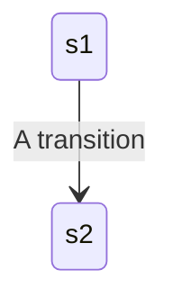

# 42-webserv

Webserv is one of the projects in 42 cursus.

<!-- START doctoc generated TOC please keep comment here to allow auto update -->
<!-- DON'T EDIT THIS SECTION, INSTEAD RE-RUN doctoc TO UPDATE -->
**Table of Contents**

- [Docs](#docs)
- [キーワード](#%E3%82%AD%E3%83%BC%E3%83%AF%E3%83%BC%E3%83%89)
- [サーバーの流れ](#%E3%82%B5%E3%83%BC%E3%83%90%E3%83%BC%E3%81%AE%E6%B5%81%E3%82%8C)
  - [HTTP STATE MACHINE](#http-state-machine)

<!-- END doctoc generated TOC please keep comment here to allow auto update -->

## Docs

- [configuration.md](docs/configuration.md)

## キーワード

- Nginx
- イベント駆動 (State machine)
- 非同期IO (O_NONBLOCK)
- ノンブロッキングIO ()
- IO多重化 (epoll)

## サーバーの流れ

[Inside NGINX: How We Designed for Performance & Scale](https://www.nginx.com/blog/inside-nginx-how-we-designed-for-performance-scale/) を元にしている｡

[nginx - The Architecture of Open Source Application](https://www.aosabook.org/en/nginx.html)

1. master process が動く｡ 設定ファイルを読み込む｡ シグナルハンドラを設定する｡ master が worker プロセスを作成する｡ listen_fd を作成する｡ (workerプロセス間での共通リソースの共有のために必要に応じて共有メモリの設定もする必要ありかも)
     ※ master は worker プロセスの作成や､ポートのバインド､コンフィグファイルの読み込み､シグナルを受信した際にworkerプロセスに送信などの特権的な操作を行う｡ それ以外のネットワークやリクエストの処理などはすべてworkerプロセスが行う｡
1. master からは設定ファイルを読み込んだ情報と､listen_fd の集合が渡される｡ 各 worker は master が読み込んだ設定ファイルに基づき設定する｡
1. worker プロセスは listen_fd と connection_fd の集合をもとに epoll() などのIO多重化によってイベント(読み書き可能や新しい接続など)が発生するのを監視する｡
  - epoll() で

### HTTP STATE MACHINE

